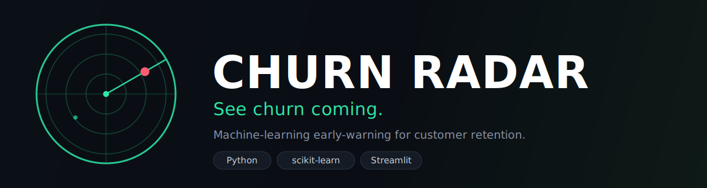

<div align="center">



<h3>See churn coming.</h3>

<p><em>An end-to-end machine-learning early-warning system that predicts which customers are about to leave, explains <strong>why</strong>, and scores new customers in real time.</em></p>

<p>
  
  
  
  
  
</p>

</div>

---

## 🛰️ Why "Churn Radar"?

Keeping a customer is far cheaper than winning a new one. Churn Radar acts like a
radar screen for your customer base: it continuously scores everyone, lights up
the ones drifting toward the exit, and tells a retention team **who to call, and
why** — before it's too late.

**Fully self-contained: no API keys, no database, no external services.** The
dataset is bundled and models train locally, so it always runs and deploys in
minutes.

---

## 🎯 What this project demonstrates

Built to reflect real ML-engineering practice, not just a model that fits:

- **Reproducible data pipeline** — a real, slightly messy dataset (7,043
  customers) cleaned and split deterministically.
- **A proper scikit-learn `Pipeline`** — median imputation, scaling, and one-hot
  encoding bundled *with* the classifier via a `ColumnTransformer`, so training
  and serving apply identical transforms (no train/serve skew).
- **Model selection done right** — Logistic Regression, Random Forest, and
  Gradient Boosting compared by **5-fold cross-validated ROC-AUC**. A
  well-regularised, class-balanced Logistic Regression wins here — a good
  reminder that simple, interpretable models are strong baselines.
- **Honest metrics for imbalanced data** — only ~26% of customers churn, so the
  app leads with **ROC-AUC, precision, and recall**, not just accuracy.
- **An adjustable decision threshold** — a live control to trade recall for
  precision, framed as the business decision it really is.
- **Explainability** — permutation importance shows what actually drives churn.
- **A live predictor** — score any customer profile and get a churn probability.
- **Tests + tooling** — a pipeline test suite, a Streamlit app smoke test, an
  offline hyperparameter-tuning script, and a `Makefile`.

---

## 🖥️ The app (five tabs)

| Tab | What's inside |
| --- | --- |
| 🏠 **Overview** | The business problem and headline performance |
| 📊 **Data & Insights** | Churn broken down by contract, tenure, service, and charges |
| 🤖 **Models & Evaluation** | CV model comparison, ROC curve, confusion matrix, precision/recall at your threshold |
| 🔍 **What Drives Churn** | Permutation-importance ranking of the features |
| 🔮 **Predict a Customer** | An interactive form returning a live churn probability + risk level |

---

## 🚀 Run it locally

Requires **Python 3.9+**.

```bash
pip install -r requirements.txt
streamlit run app.py
```

Or use the shortcuts:

```bash
make install   # install dependencies
make app       # run the app
make test      # run the test suite
make train     # compare models + tune the best (offline)
```

### Tests

```bash
python tests/test_pipeline.py     # ML pipeline checks
python tests/test_app_smoke.py    # headless app boot test
# or simply:  pytest
```

---

## ☁️ Deploy it free (Streamlit Community Cloud)

No credit card, no servers.

1. Push this repo to **GitHub**.
2. Go to **https://share.streamlit.io** → sign in with GitHub.
3. **Create app** → **Deploy a public app from GitHub**.
4. Choose this **repository**, branch **`main`**, main file **`app.py`**.
5. **Deploy** — a couple of minutes later you get a public link to share.

`requirements.txt` is detected automatically; nothing else to configure.

---

## 📈 Results

Held-out test performance (Logistic Regression, threshold 0.5):

| Metric | Score |
| ------ | ----- |
| ROC-AUC | ~0.84 |
| Recall (churners caught) | ~0.78 |
| Precision | ~0.50 |

Lowering the decision threshold catches more churners (higher recall) at the cost
of more false alarms — the app lets you explore this trade-off live.

---

## 📁 Project structure

```
.
├── app.py                  # Streamlit app (the five-tab UI)
├── train.py                # offline model comparison + hyperparameter tuning
├── data/
│   └── telco_churn.csv      # bundled dataset (no runtime download)
├── src/
│   ├── data.py             # loading, cleaning, reproducible split, feature metadata
│   ├── pipeline.py         # preprocessing ColumnTransformer + model definitions
│   └── evaluate.py         # model comparison, evaluation, explainability, prediction
├── tests/                  # pipeline checks + Streamlit smoke test
├── assets/                 # brand logo + banner
├── requirements.txt
├── Makefile
└── .streamlit/config.toml  # brand theme
```

---

## 📚 Dataset

The [Telco Customer Churn](https://www.kaggle.com/datasets/blastchar/telco-customer-churn)
dataset (IBM sample data): 7,043 customers with account, demographic, and service
attributes, labelled by whether they churned. Bundled in `data/` for offline,
reproducible runs.

---

<div align="center">
<sub>Churn Radar · built with scikit-learn + Streamlit · self-contained, no API keys required.</sub>
</div>
